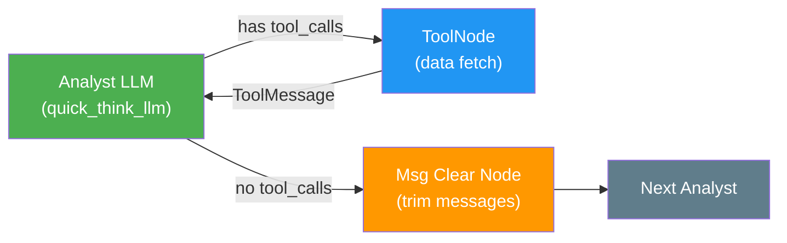
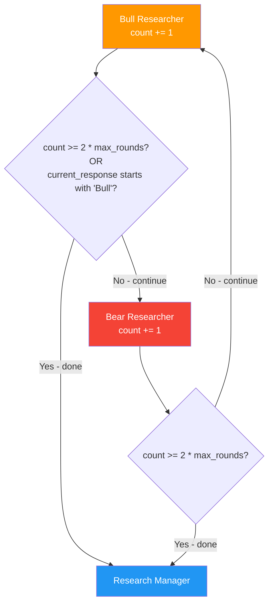
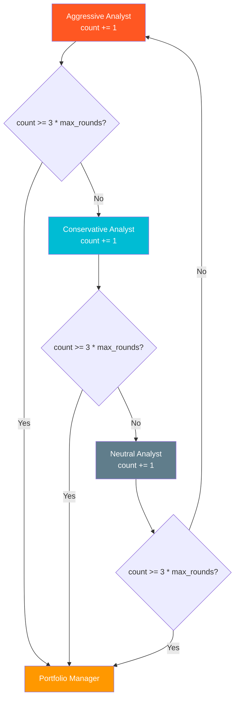
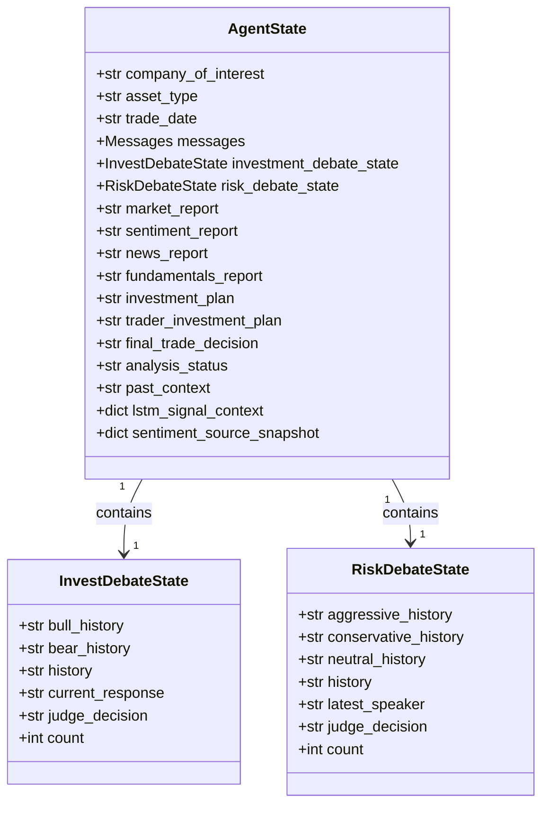
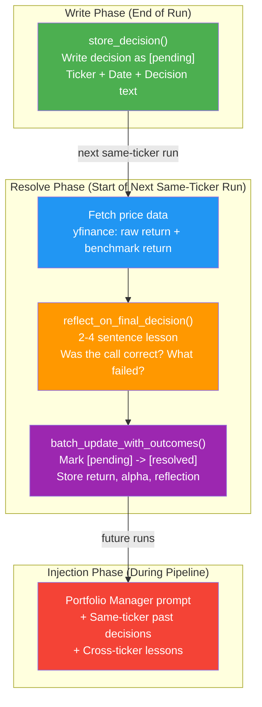
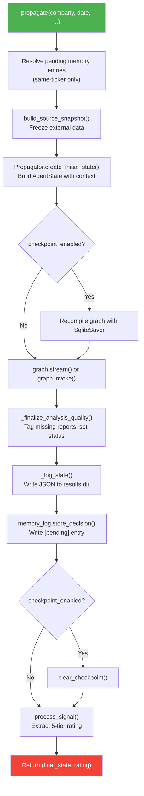
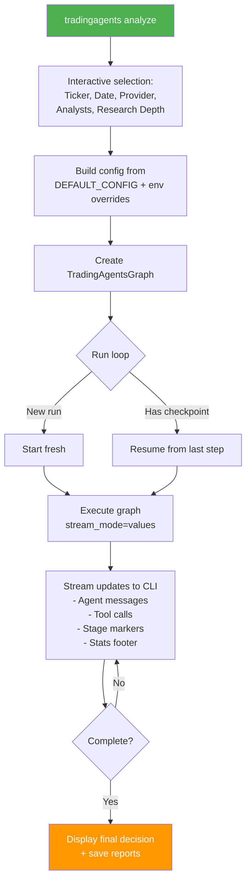

# TradingAgents Agentic Flow Design Document

> **Reference**: The canonical pipeline is documented in [workflow-diagram.md](./workflow-diagram.md). This file formalizes the design for consumption, extension, and operational understanding covering node topology, memory, checkpointing, human-in-the-loop (HITL) hooks, configuration surface, and extension points.

---

## 1. Executive Summary

TradingAgents is a **workflow-based multi-agent system** built on **LangGraph** that orchestrates a pipeline of specialized LLM-powered analysts to produce investment decisions (Buy / Overweight / Hold / Underweight / Sell) with price targets and time horizons. The architecture follows the principle: Use structured workflows where possible, agents only where truly required.

- **Orchestration**: `langgraph.graph.StateGraph` with conditional edges forming a state machine.
- **State Passing**: A single shared `AgentState` (extending `langgraph.graph.MessagesState`) carries all inter-node context via `messages` list plus typed fields.
- **Debate Mechanism**: Two alternating debate loops Bull-Bear and Aggressive-Conservative-Neutral bounded by round counters to prevent runaway LLM calls.
- **Persistence**: SQLite-backed LangGraph checkpointer per ticker-date pair enables resumable runs.
- **Memory System**: Append-only `.tradingagents/memory/trading_memory.md` log with post-run reflection, alpha evaluation, and context injection into future runs.
- **LLM Abstraction**: Multi-provider factory (`OpenAI`, `Anthropic`, `Google`, `xAI`, `DeepSeek`, `Ollama`, `OpenRouter`, `Azure`) with separate "deep" and "quick" thinking LLM instances.

---

## 2. Library and Dependency Reference

| Library | Version | Purpose |
|---------|---------|---------|
| `langgraph` | `>=0.4.8` | StateGraph orchestration, conditional edges, stream_mode, checkpointing |
| `langgraph-checkpoint-sqlite` | `>=2.0.0` | SQLite-based graph state persistence (resumable runs) |
| `langchain-core` | `>=0.3.81` | Base message types (`HumanMessage`, `AIMessage`, `ToolMessage`, `RemoveMessage`) |
| `langchain-openai` | `>=0.3.23` | OpenAI GPT-5.x family support |
| `langchain-anthropic` | `>=0.3.15` | Claude 4.x support |
| `langchain-google-genai` | `>=4.0.0` | Gemini 3.x support |
| `langchain-experimental` | `>=0.3.4` | Experimental utilities |
| `yfinance` | `>=0.2.63` | Stock data, news, profile metadata |
| `stockstats` | `>=0.6.5` | Technical indicators (RSI, MACD, etc.) |
| `pandas` | `>=2.3.0` | Data manipulation |
| `Telethon` | `==1.44.0` | Telegram channel scraping |
| `pytrends` | `==4.9.2` | Google Trends data |
| `questionary` | `>=2.1.0` | Interactive CLI prompts |
| `typer` | `>=0.21.0` | CLI framework |
| `rich` | `>=14.0.0` | Terminal UI (panels, tables, spinners, live rendering) |
| `requests` | `>=2.32.4` | HTTP data fetching |
| `redis` | `>=6.2.0` | Optional caching layer |

---

## 3. Agent Graph Topology

### 3.1 Complete Pipeline Flow

```mermaid
flowchart TD
    START((START)) --> SNAPSHOT["Build Source Snapshot<br/><i>Freeze per-ticker data from Yahoo Finance,<br/>Google News, Reddit, Telegram, Google Trends</i>"]

    SNAPSHOT --> INIT["Initialize AgentState<br/><i>Inject memory log context,<br/>validate LSTM signals,<br/>set trade horizon + entry price</i>"]

    INIT --> MA["Market Analyst<br/><i>Technical analysis: stock data, indicators</i><br/>LLM: Quick | Tools: get_stock_data, get_indicators"]

    MA --> SA["Sentiment Analyst<br/><i>Grounded sentiment from frozen snapshot</i><br/>LLM: Quick | Tools: get_news"]

    SA --> NA["News Analyst<br/><i>Ticker-specific + global macro news</i><br/>LLM: Quick | Tools: get_news, get_global_news, get_insider_transactions"]

    NA --> FA["Fundamentals Analyst<br/><i>Financial statements analysis</i><br/>LLM: Quick | Tools: get_fundamentals, get_balance_sheet, get_cashflow, get_income_statement"]

    FA --> BULL["Bull Researcher<br/><i>Argue the bull case</i><br/>LLM: Quick"]

    BULL --> DEBATE_CHECK{"Investment Debate<br/>count < 2 * max_rounds?"}

    DEBATE_CHECK -->|Yes| BEAR["Bear Researcher<br/><i>Argue the bear case</i><br/>LLM: Quick"]
    BEAR --> DEBATE_CHECK

    DEBATE_CHECK -->|No - max rounds reached| RM["Research Manager<br/><i>Synthesize debate into Investment Plan</i><br/>LLM: Deep"]

    RM --> TRADER["Trader<br/><i>Transaction proposal: BUY/HOLD/SELL,<br/>entry price, stop loss, confidence</i><br/>LLM: Quick"]

    TRADER --> AGG["Aggressive Analyst<br/><i>Pro-risk, maximize returns</i><br/>LLM: Quick"]

    AGG --> RISK_CHECK{"Risk Debate<br/>count < 3 * max_rounds?"}

    RISK_CHECK -->|Yes| CONS["Conservative Analyst<br/><i>Capital preservation</i><br/>LLM: Quick"]
    CONS --> RISK_CHECK2{"Risk Debate<br/>count < 3 * max_rounds?"}

    RISK_CHECK -->|Yes| NEUT["Neutral Analyst<br/><i>Balanced perspective</i><br/>LLM: Quick"]
    RISK_CHECK2 -->|Yes| NEUT
    NEUT --> RISK_CHECK3{"Risk Debate<br/>count < 3 * max_rounds?"}
    RISK_CHECK3 -->|Yes| AGG

    RISK_CHECK -->|No| PM
    RISK_CHECK2 -->|No| PM
    RISK_CHECK3 -->|No| PM

    PM["Portfolio Manager<br/><i>Final decision: Rating, Price Target,<br/>Time Horizon, Thesis</i><br/>LLM: Deep"]

    PM --> SIGNAL["Signal Processing<br/><i>Extract 5-tier rating from PM output</i>"]

    SIGNAL --> MEMORY["Memory Log Update<br/><i>Store decision as [pending]</i>"]

    MEMORY --> REFLECT["Post-Run Reflection<br/><i>Resolve pending entries,<br/>compute alpha vs benchmark,<br/>generate lessons</i>"]

    REFLECT --> SAVE["Save Reports<br/><i>Per-ticker JSON + markdown</i>"]

    SAVE --> END((END))

    style START fill:#4CAF50,color:#fff
    style END fill:#f44336,color:#fff
    style PM fill:#FF9800,color:#fff
    style RM fill:#2196F3,color:#fff
    style BULL fill:#FF9800,color:#fff
    style BEAR fill:#F44336,color:#fff
    style TRADER fill:#9C27B0,color:#fff
    style AGG fill:#FF5722,color:#fff
    style CONS fill:#00BCD4,color:#fff
    style NEUT fill:#607D8B,color:#fff
```

### 3.2 Analyst Tool-Calling Loop

Each analyst node follows the same pattern: the LLM generates tool calls, a `ToolNode` executes them, results return as `ToolMessage`, and the loop continues until the LLM produces a final text response with no tool calls. A message-clearing node then trims the conversation before passing state to the next analyst.

### 3.3 Investment Debate Loop (Bull vs Bear)

The debate alternates between Bull and Bear researchers. The routing logic checks `current_response` to determine who spoke last: if it starts with `"Bull"`, route to Bear; otherwise route to Bull. The loop terminates when `count >= 2 * max_debate_rounds`.

### 3.4 Risk Debate Loop (3-Way)

The risk debate rotates through three analysts: Aggressive -> Conservative -> Neutral -> Aggressive. The `latest_speaker` field determines who speaks next. The loop terminates when `count >= 3 * max_risk_discuss_rounds`.

### 3.5 Node Classification Table

| # | Node Name | Agent Type | LLM Tier | Tool Use | Purpose |
|---|-----------|------------|----------|----------|---------|
| 0 | Market Analyst | Specialist | Quick | Yes (get_stock_data, get_indicators) | Technical analysis |
| 1 | Sentiment Analyst | Specialist | Quick | Yes (get_news - frozen snapshot) | Grounded sentiment from news/social |
| 2 | News Analyst | Specialist | Quick | Yes (get_news, get_global_news, get_insider_transactions) | Ticker + macro news |
| 3 | Fundamentals Analyst | Specialist | Quick | Yes (get_fundamentals, get_balance_sheet, get_cashflow, get_income_statement) | Financial statement analysis |
| 4 | Bull Researcher | Debater | Quick | No | Argue bull case |
| 5 | Bear Researcher | Debater | Quick | No | Argue bear case |
| 6 | Research Manager | Synthesizer | Deep | No | Debate synthesis -> Investment Plan |
| 7 | Trader | Proposer | Quick | No | Transaction proposal with entry/stop |
| 8 | Aggressive Analyst | Debater | Quick | No | Pro-risk, maximize returns |
| 9 | Conservative Analyst | Debater | Quick | No | Capital preservation |
| 10 | Neutral Analyst | Debater | Quick | No | Balanced perspective |
| 11 | Portfolio Manager | Decider | Deep | No | Final rating + price target + thesis |

### 3.6 LLM Call Budget Per Run

| Phase | Model | Calls (default rounds=1) | Calls (max rounds=5) | Notes |
|-------|-------|--------------------------|----------------------|-------|
| 4 Analysts | Quick | ~8 | ~8 | 1-3 tool-call rounds + 1 synthesis per analyst |
| Bull/Bear Debate | Quick | 2 | 10 | 2 per round (Bull + Bear) |
| Research Manager | Deep | 1-2 | 1-2 | 1 structured call + optional grounding repair |
| Trader | Quick | 1-2 | 1-2 | 1 structured call + optional repair |
| Risk Debate (3-way) | Quick | 3 | 15 | 3 per round (Aggressive + Conservative + Neutral) |
| Portfolio Manager | Deep | 1-2 | 1-2 | 1 structured call + optional repair |
| Reflection | Quick | 1 | 1 | Post-run alpha assessment |
| **Total** | | **~17-21** | **~30-40** | **~85% Quick, ~15% Deep** |

---

## 4. State Schema

### 4.1 AgentState (Primary State Container)

The `AgentState` extends LangGraph's `MessagesState` and carries all inter-node data through the pipeline.

### 4.2 Structured Output Schemas

| Schema | Produced By | Fields |
|--------|-------------|--------|
| `ResearchPlan` | Research Manager | rating (5-tier), bull_case, bear_case, recommendation, rationale |
| `TraderProposal` | Trader | action (BUY/HOLD/SELL), entry_price, stop_loss, confidence, rationale |
| `PortfolioDecision` | Portfolio Manager | rating, price_target, time_horizon, thesis, risk_assessment, lstm_thesis_assessment, model_disagreement_reason |

---

## 5. Memory and Persistence

### 5.1 Memory Log Architecture

### 5.2 Checkpoint System

| Component | Implementation | Purpose |
|-----------|---------------|---------|
| Checkpointer | `SqliteSaver` per ticker | Saves state after each node |
| Thread ID | `{ticker}_{date}` | Ensures same-ticker resume, fresh start for new date |
| Resume | Automatic on `checkpoint_enabled=True` | Re-enters graph at last successful node |
| Cleanup | `clear_checkpoint()` on completion | Removes stale state |

### 5.3 Source Snapshot (Frozen Data)

The `build_source_snapshot()` function freezes all external data at run start to ensure consistency across analysts:

| Source | Data | Consumers |
|--------|------|-----------|
| Yahoo Finance | Company profile, key stats | Market Analyst, Fundamentals Analyst |
| Yahoo Finance News | Ticker-specific news articles | News Analyst, Sentiment Analyst |
| Google News | India-localized macro news | News Analyst |
| Reddit | Stock sentiment posts | Sentiment Analyst |
| Telegram | Channel messages | Sentiment Analyst |
| Google Trends | Search interest data | Sentiment Analyst |
| Tavily | Company news fallback | News Analyst (when Yahoo unavailable) |

---

## 6. Configuration Surface

### 6.1 DEFAULT_CONFIG Keys

| Key | Default | Env Override | Purpose |
|-----|---------|-------------|---------|
| `llm_provider` | `"openai"` | `TRADINGAGENTS_LLM_PROVIDER` | LLM provider selection |
| `deep_think_llm` | `"gpt-5.4"` | `TRADINGAGENTS_DEEP_THINK_LLM` | Model for Research Manager + Portfolio Manager |
| `quick_think_llm` | `"gpt-5.4-mini"` | `TRADINGAGENTS_QUICK_THINK_LLM` | Model for all other agents |
| `backend_url` | `None` | `TRADINGAGENTS_LLM_BACKEND_URL` | Custom API endpoint |
| `max_debate_rounds` | `1` | `TRADINGAGENTS_MAX_DEBATE_ROUNDS` | Bull/Bear debate rounds |
| `max_risk_discuss_rounds` | `1` | `TRADINGAGENTS_MAX_RISK_ROUNDS` | Risk debate rounds |
| `checkpoint_enabled` | `False` | `TRADINGAGENTS_CHECKPOINT_ENABLED` | Enable SQLite checkpointing |
| `analyst_concurrency_limit` | `1` | - | Max parallel analysts |
| `max_recur_limit` | `100` | - | Max graph recursion depth |
| `output_language` | `"English"` | `TRADINGAGENTS_OUTPUT_LANGUAGE` | Report language |

### 6.2 Trade Context Parameters

These are injected by the orchestrator (`orchestrate_market_pipeline.py`) for production runs:

| Parameter | Source | Purpose |
|-----------|--------|---------|
| `entry_price` | LSTM signal context | Current price for analysis framing |
| `trade_horizon_days` | LSTM signal context | Holding period (typically 7 sessions) |
| `profit_target_pct` | LSTM signal context | Target return (3% for momentum) |
| `stop_loss_pct` | LSTM signal context | Max loss (-4.5% for momentum) |
| `trade_strategy` | LSTM signal context | Strategy type (e.g. `pullback_within_established_momentum`) |
| `lstm_signal_context` | LSTM signal context | Full LSTM evidence payload for TA validation |

---

## 7. Entry Point and Execution Flow

### 7.1 Programmatic Entry (TradingAgentsGraph.propagate)

### 7.2 CLI Entry

---

## 8. Extension Points

### 8.1 Adding a New Analyst

1. Create agent file in `tradingagents/agents/analysts/`
2. Define factory function `create_xxx_analyst(quick_thinking_llm)` that returns a callable node
3. Add tool functions in `tradingagents/agents/utils/agent_utils.py`
4. Register tools in `TradingAgentsGraph._create_tool_nodes()`
5. Add to `analyst_factories` dict in `GraphSetup.setup_graph()`
6. Add conditional logic method in `ConditionalLogic`
7. Add node classification row in section 3.5

### 8.2 Adding a New LLM Provider

1. Create client file in `tradingagents/llm_clients/`
2. Implement `BaseLLMClient` interface with `get_llm()` method
3. Register in `factory.py` `_OPENAI_COMPATIBLE` or add custom routing
4. Add env var mapping in `api_key_env.py`
5. Add base URL in `openai_client.py` `_PROVIDER_BASE_URL` if applicable
6. Add model options in `model_catalog.py`

### 8.3 Adding a New Data Source

1. Create data flow module in `tradingagents/dataflows/`
2. Add tool function in `tradingagents/agents/utils/agent_utils.py`
3. Register in appropriate ToolNode in `_create_tool_nodes()`
4. Optionally add to `build_source_snapshot()` for frozen data consistency

---

## 9. Operational Considerations

### 9.1 Cost Estimation

| Component | Token Volume | Cost Driver |
|-----------|-------------|-------------|
| Analysts | High (tool outputs embedded in prompts) | Stock data CSVs, news articles, financial statements |
| Bull/Bear Debate | Medium (grows with rounds) | Each round adds 2 full conversation turns |
| Research Manager | Low (1-2 calls) | Synthesizes debate history |
| Trader | Low (1-2 calls) | Structured proposal from investment plan |
| Risk Debate | High (3 per round) | Each round adds 3 conversation turns |
| Portfolio Manager | Low (1-2 calls) | Final decision with full context |

### 9.2 Failure Modes

| Failure | Detection | Recovery |
|---------|-----------|----------|
| LLM provider timeout | Exception in node | Checkpoint resume (if enabled) |
| Missing API key | ValueError at client init | Fail fast with clear error message |
| Stale price data | `_fetch_returns()` returns None | Skip reflection, retry next run |
| Empty analyst report | `_finalize_analysis_quality()` tags MISSING_* | Pipeline continues, tags quality issues |
| Graph recursion limit | LangGraph `RecursionError` | Increase `max_recur_limit` or reduce rounds |

### 9.3 Performance Tuning

| Parameter | Effect | Recommendation |
|-----------|--------|---------------|
| `max_debate_rounds` | More Bull/Bear turns = deeper analysis but higher cost | 1 for quick scans, 3-5 for deep research |
| `max_risk_discuss_rounds` | More risk perspectives = better risk assessment | 1 for quick scans, 3-5 for deep research |
| `analyst_concurrency_limit` | Parallel analyst execution | Keep at 1 for most cases (tool I/O is the bottleneck) |
| `checkpoint_enabled` | Resumable runs on crash | Enable for production, disable for development |

---

*Document version: 2.0 - Generated from TradingAgents codebase analysis.*
