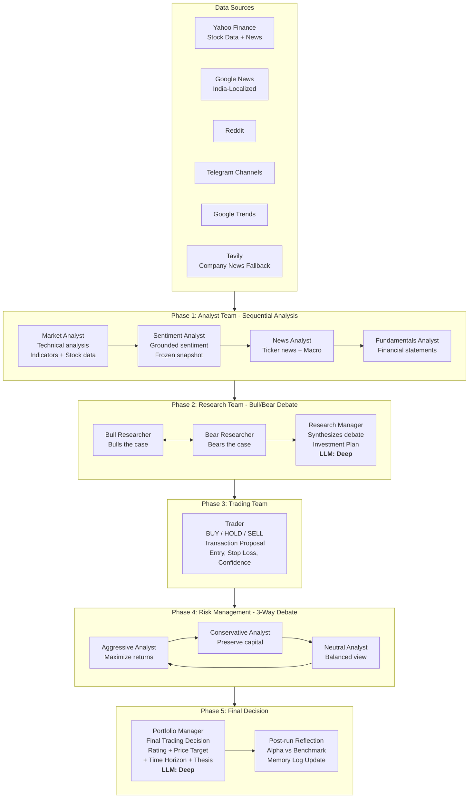
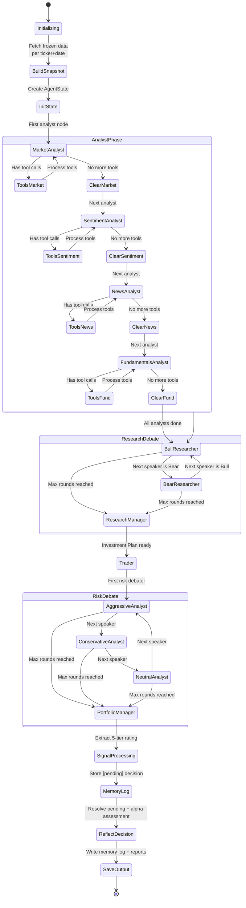
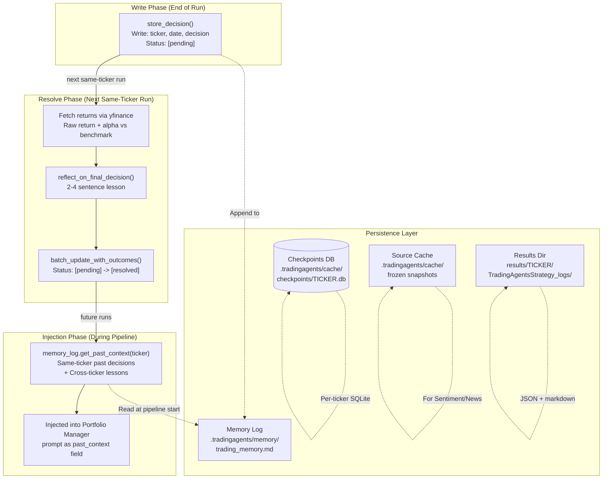
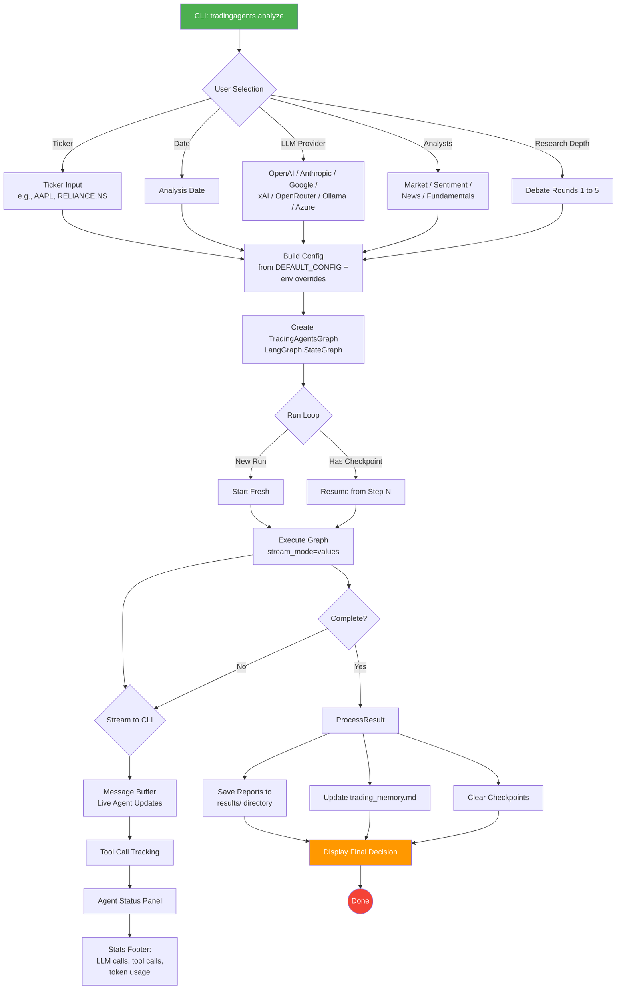

# TradingAgents Workflow Diagram

## Architecture Overview: A Workflow-Based Multi-Agent System

TradingAgents is a **workflow-based** multi-agent system built on **LangGraph** that orchestrates a predefined series of specialized AI agent calls, each focused on a specific subtask within the trading decision pipeline.

> **Key Design Principle**: Always focus on implementing workflows where possible, and only resort to agents when they are truly required. TradingAgents follows this by using structured **workflows** for the main pipeline (predictable, testable, reliable) and agent-like capabilities within each node (LLMs with tool use that can dynamically choose which data sources to query).

---

## 1. Complete Pipeline Flow

```mermaid
flowchart TD
    START((Start)) --> SNAPSHOT[Build Source Snapshot<br/>Freeze per-ticker data from Yahoo Finance,<br/>Google News, Reddit, Telegram,<br/>Google Trends]

    SNAPSHOT --> INIT[Prepare State<br/>Build instrument context,<br/>Validate LSTM signals,<br/>Fetch memory log context]

    INIT --> MA[Market Analyst<br/>Technical analysis<br/>Stock data + Indicators<br/><i>LLM: Quick | Tools: get_stock_data, get_indicators</i>]

    MA --> SA[Sentiment Analyst<br/>Frozen source snapshot<br/>Grounded claims only<br/><i>LLM: Quick | Tools: get_news</i>]

    SA --> NA[News Analyst<br/>Ticker-specific news<br/>Global macro enrichment<br/><i>LLM: Quick | Tools: get_news, get_global_news, get_insider_transactions</i>]

    NA --> FA[Fundamentals Analyst<br/>Financial statements<br/>BS, Cashflow, Income<br/><i>LLM: Quick | Tools: get_fundamentals, get_balance_sheet, get_cashflow, get_income_statement</i>]

    FA --> BULL[Bull Researcher<br/>Bulls the bull case<br/><i>LLM: Quick</i>]

    BULL --> DEBATE_CHECK{Investment Debate<br/>count < 2 * max_rounds?}

    DEBATE_CHECK -->|Yes| BEAR[Bear Researcher<br/>Bears the bear case<br/><i>LLM: Quick</i>]
    BEAR --> DEBATE_CHECK

    DEBATE_CHECK -->|No - max rounds reached| RM[Research Manager<br/>Synthesize debate<br/>Generate Investment Plan<br/>Buy/Overweight/Hold/<br/>Underweight/Sell<br/><i>LLM: Deep</i>]

    RM --> TRADER[Trader<br/>Transaction Proposal<br/>Decision: BUY / HOLD / SELL<br/>Entry price, Stop loss<br/><i>LLM: Quick</i>]

    TRADER --> AGG[Aggressive Analyst<br/>Pro-risk perspective<br/>Maximize returns<br/><i>LLM: Quick</i>]

    AGG --> RISK_CHECK{Risk Debate<br/>count < 3 * max_rounds?}

    RISK_CHECK -->|Yes| CONS[Conservative Analyst<br/>Risk-averse perspective<br/>Preserve capital<br/><i>LLM: Quick</i>]
    CONS --> RISK_CHECK2{Risk Debate<br/>count < 3 * max_rounds?}

    RISK_CHECK2 -->|Yes| NEUT[Neutral Analyst<br/>Balanced perspective<br/>Moderate risk<br/><i>LLM: Quick</i>]
    NEUT --> RISK_CHECK3{Risk Debate<br/>count < 3 * max_rounds?}
    RISK_CHECK3 -->|Yes| AGG

    RISK_CHECK -->|No| PM[Portfolio Manager<br/>Final Decision<br/>Rating, Price Target,<br/>Time Horizon, Thesis<br/><i>LLM: Deep</i>]
    RISK_CHECK2 -->|No| PM
    RISK_CHECK3 -->|No| PM

    PM --> SIGNAL[Signal Processing<br/>Extract 5-tier rating]
    SIGNAL --> MEMORY[Update Trading Memory<br/>Store decision as [pending]]
    MEMORY --> REFLECT[Reflection Step<br/>Resolve pending entries<br/>Assess alpha vs benchmark<br/>Generate lessons]
    REFLECT --> SAVE[Save Reports<br/>Per-ticker JSON + markdown]

    SAVE --> END((End))

    style START fill:#4CAF50,color:#fff
    style END fill:#f44336,color:#fff
    style PM fill:#FF9800,color:#fff
    style RM fill:#2196F3,color:#fff
    style BULL fill:#FF9800,color:#fff
    style BEAR fill:#F44336,color:#fff
    style TRADER fill:#9C27B0,color:#fff
    style AGG fill:#FF5722,color:#fff
    style CONS fill:#00BCD4,color:#fff
    style NEUT fill:#607D8B,color:#fff
```

---

## 2. LangGraph State Machine Topology

```mermaid
flowchart TD
    START_START[START] --> MA_N["Market Analyst<br/>state: messages, trade_date"]

    MA_N --> MA_Cond{should_continue_market?<br/>any tool_calls?}
    MA_Cond -->|Yes: tool_calls| tools_m["ToolNode: tools_market<br/>get_stock_data,<br/>get_indicators"]
    MA_Cond -->|No: no tools| clear_m["Msg Clear Market"]

    tools_m --> MA_N

    clear_m --> SA_N["Sentiment Analyst<br/>state: messages, trade_date"]
    SA_N --> SA_Cond{should_continue_social?<br/>any tool_calls?}
    SA_Cond -->|Yes: tool_calls| tools_s["ToolNode: tools_social<br/>get_news"]
    SA_Cond -->|No| clear_s["Msg Clear Sentiment"]
    tools_s --> SA_N

    clear_s --> NA_N["News Analyst<br/>state: messages, trade_date"]
    NA_N --> NA_Cond{should_continue_news?<br/>any tool_calls?}
    NA_Cond -->|Yes| tools_n["ToolNode: tools_news<br/>get_news, get_global_news,<br/>get_insider_transactions"]
    NA_Cond -->|No| clear_n["Msg Clear News"]
    tools_n --> NA_N

    clear_n --> FA_N["Fundamentals Analyst<br/>state: messages, trade_date"]
    FA_N --> FA_Cond{should_continue_fundamentals?<br/>any tool_calls?}
    FA_Cond -->|Yes| tools_f["ToolNode: tools_fundamentals<br/>get_fundamentals,<br/>get_balance_sheet,<br/>get_cashflow,<br/>get_income_statement"]
    FA_Cond -->|No| clear_f["Msg Clear Fundamentals"]
    tools_f --> FA_N

    clear_f --> BULL_N["Bull Researcher<br/>InvestDebateState<br/>count += 1"]

    BULL_N --> BULL_Cond{should_continue_debate?<br/>count >= 2*max_rounds?}
    BULL_Cond -->|No - continue| BEAR_N["Bear Researcher<br/>InvestDebateState<br/>count += 1"]
    BULL_Cond -->|Yes - done| RM_N["Research Manager<br/>(Deep LLM)"]

    BEAR_N --> BEAR_Cond{should_continue_debate?<br/>count >= 2*max_rounds?}
    BEAR_Cond -->|No - continue| BULL_N
    BEAR_Cond -->|Yes - done| RM_N

    RM_N --> TRADER_N["Trader<br/>(Quick LLM)"]
    TRADER_N --> AGG_N["Aggressive Analyst<br/>RiskDebateState<br/>count += 1"]

    AGG_N --> AGG_Cond{should_continue_risk?<br/>count >= 3*max_rounds?}
    AGG_Cond -->|No - continue| CONS_N["Conservative Analyst<br/>RiskDebateState<br/>count += 1"]
    AGG_Cond -->|Yes - done| PM_N["Portfolio Manager<br/>(Deep LLM)"]

    CONS_N --> CONS_Cond{should_continue_risk?<br/>count >= 3*max_rounds?}
    CONS_Cond -->|No - continue| NEUT_N["Neutral Analyst<br/>RiskDebateState<br/>count += 1"]
    CONS_Cond -->|Yes - done| PM_N

    NEUT_N --> NEUT_Cond{should_continue_risk?<br/>count >= 3*max_rounds?}
    NEUT_Cond -->|No - continue| AGG_N
    NEUT_Cond -->|Yes - done| PM_N

    PM_N --> END_NODE[END]

    style START_START fill:#4CAF50,color:#fff
    style END_NODE fill:#f44336,color:#fff
    style BULL_N fill:#FF9800,color:#fff
    style BEAR_N fill:#F44336,color:#fff
    style PM_N fill:#FF9800,color:#fff
    style RM_N fill:#2196F3,color:#fff
    style TRADER_N fill:#9C27B0,color:#fff
    style AGG_N fill:#FF5722,color:#fff
    style CONS_N fill:#00BCD4,color:#fff
    style NEUT_N fill:#607D8B,color:#fff
```



---

## 3. Agent Teams and Responsibilities



---

## 4. Data Flow and State Transitions



---

## 5. Memory and Persistence Architecture



---

## 6. Workflow vs Agent Architecture Analysis

TradingAgents is primarily a **workflow-based architecture** with **agent-like capabilities within each workflow node**. The main pipeline has a predefined sequence of steps with clear entry/exit points, making it predictable and testable. Within each node, LLM agents use tool-calling to dynamically choose which data sources to query.

| Concept | How TradingAgents Implements It |
|---------|--------------------------------|
| **Workflows** (predefined step sequence) | LangGraph StateGraph with ordered analyst -> researcher -> trader -> risk managers |
| **Agents** (tool use, adaptability) | Each node uses LLM with dynamic tool selection (get_stock_data, get_indicators, etc.) |
| **Benefits of Workflows** (higher accuracy, easier to test) | Each analyst node is independently testable; sequential execution ensures data readiness |
| **Benefits of Agents** (flexibility, creative problem-solving) | Debates allow bull/bear researchers and risk debators to adapt arguments dynamically |
| **When to use workflows** (well-defined processes) | The entire trading pipeline - known sequence from analysis to decision |
| **When to use agents** (unpredictable scenarios) | Debate phase handles novel market conditions that were not anticipated |

---

## 7. Entry Point and CLI Flow



---

## 8. Project File Tree Reference

```
TradingAgents/
|
+-- cli/                                    # CLI Entry Point (typer)
|       +-- main.py                           # CLI app + message buffer + run loop
|       +-- config.py                         # Config helpers for typer
|       +-- models.py                         # AnalystType enums + selections
|       +-- utils.py                          # User selection helpers
|       +-- announcements.py                  # API announcements display
|       +-- stats_handler.py                  # LLM/tool call stats tracking
|
+-- tradingagents/
|       |
|       +-- graph/                            # LangGraph Orchestration
|       |       +-- trading_graph.py             # Main TradingAgentsGraph class
|       |       +-- setup.py                     # StateGraph builder (GraphSetup)
|       |       +-- analyst_execution.py         # Execution plan + wall time tracking
|       |       +-- conditional_logic.py         # Node transition predicates
|       |       +-- checkpointer.py              # SQLite checkpoint support
|       |       +-- propagation.py               # State init + LSTM context propagation
|       |       +-- reflection.py                # Post-run reflection on alpha
|       |       +-- signal_processing.py         # Signal extraction from final decision
|       |
|       +-- agents/                           # Multi-Agent Definitions
|       |       +-- analysts/
|       |       |       +-- market_analyst.py        # Technical analysis agent
|       |       |       +-- sentiment_analyst.py     # Grounded sentiment (frozen snapshot)
|       |       |       +-- news_analyst.py          # Ticker + macro news
|       |       |       +-- fundamentals_analyst.py  # Financial statements
|       |       +-- researchers/
|       |       |       +-- bull_researcher.py       # Bull case
|       |       |       +-- bear_researcher.py       # Bear case
|       |       +-- managers/
|       |       |       +-- research_manager.py      # Investment plan synthesis
|       |       |       +-- portfolio_manager.py     # Final decision + rating
|       |       +-- trader/
|       |       |       +-- trader.py                # Transaction proposal
|       |       +-- risk_mgmt/
|       |       |       +-- aggressive_debator.py    # Maximize returns
|       |       |       +-- conservative_debator.py  # Preserve capital
|       |       |       +-- neutral_debator.py       # Balanced view
|       |       +-- schemas.py                   # Pydantic: ResearchPlan, TraderProposal, PortfolioDecision
|       |       +-- utils/
|       |           +-- agent_states.py          # AgentState + debate state TypedDicts
|       |           +-- agent_utils.py           # Shared agent helpers
|       |           +-- structured.py            # Structured output binding per provider
|       |           +-- memory.py                # TradingMemoryLog (file-based)
|       |           +-- lstm_context.py          # LSTM signal validation/rendering
|       |
|       +-- dataflows/                        # Data Sources
|       |       +-- y_finance.py                 # Yahoo Finance stock data
|       |       +-- yfinance_news.py             # Yahoo Finance news
|       |       +-- alpha_vantage_stock.py       # Alpha Vantage stock data
|       |       +-- alpha_vantage_fundamentals.py # Alpha Vantage fundamentals
|       |       +-- alpha_vantage_news.py        # Alpha Vantage news
|       |       +-- reddit.py                    # Reddit data
|       |       +-- telegram.py                  # Telegram channels
|       |       +-- google_trends.py             # Google Trends
|       |       +-- tavily_news.py               # Tavily company news fallback
|       |       +-- source_snapshot.py           # Frozen per-ticker snapshot
|       |       +-- interface.py                 # Data provider interface
|       |
|       +-- llm_clients/                      # Multi-Provider LLM Support
|       |       +-- factory.py                   # LLM client factory
|       |       +-- openai_client.py             # OpenAI (GPT-5.x family)
|       |       +-- anthropic_client.py          # Anthropic (Claude 4.x)
|       |       +-- google_client.py             # Google (Gemini 3.x)
|       |       +-- azure_client.py              # Azure OpenAI
|       |       +-- model_catalog.py             # Model registry
|       |       +-- capabilities.py              # Provider capability detection
|       |       +-- api_key_env.py               # Provider -> env var mapping
|       |
|       +-- default_config.py                # DEFAULT_CONFIG + env var overrides
|       +-- __init__.py                      # Package exports
|
+-- tests/                                  # Comprehensive test suite
+-- Dockerfile                              # Container deployment
+-- pyproject.toml                          # Package config + dependencies
+-- README.md                               # Documentation
```

---

## 9. Key Takeaways

| Aspect | Implementation |
|--------|---------------|
| **Architecture Type** | Workflow-based (LangGraph StateGraph with predefined node sequence) |
| **Orchestration** | LangGraph with conditional edges between nodes |
| **Agent Communication** | Shared AgentState dict + message history passing |
| **Debate Mechanism** | Two-agent (Bull/Bear) + Three-agent (Risk) alternating debates with round limits |
| **Persistence** | Memory log file + SQLite checkpoints + frozen source snapshots |
| **LLM Providers** | OpenAI, Anthropic, Google, xAI, OpenRouter, Ollama, Azure |
| **Data Sources** | Yahoo Finance, Alpha Vantage, Reddit, Telegram, Google Trends, Tavily |
| **Decision Output** | 5-tier rating (Buy/Overweight/Hold/Underweight/Sell) with price target + time horizon |
| **Memory System** | Post-run reflection on alpha vs benchmark, re-injected into future PM prompts |
| **Design Pattern** | Workflows for reliability + Agent capabilities within each workflow node |

---

*Generated from TradingAgents codebase analysis.*
